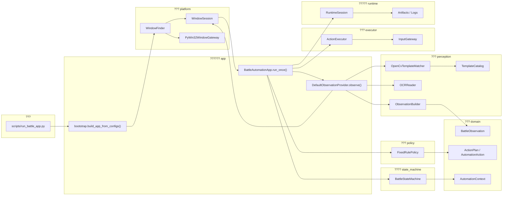
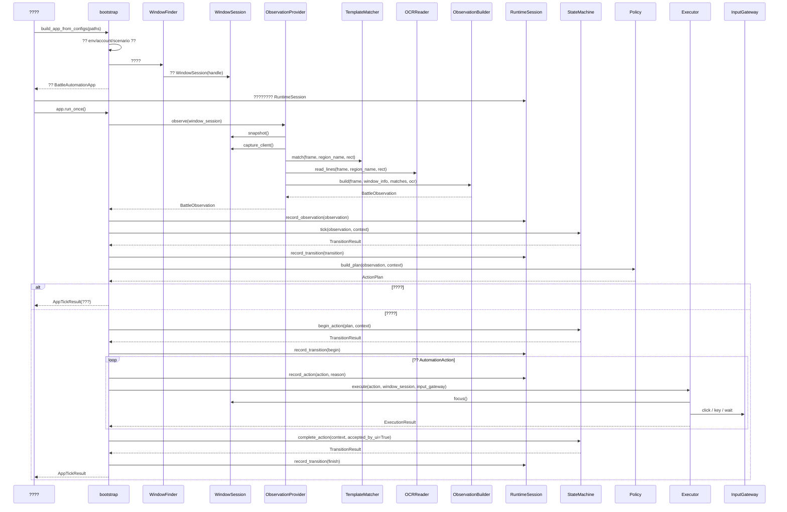
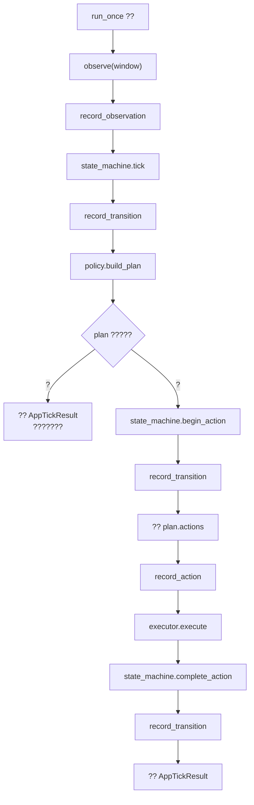
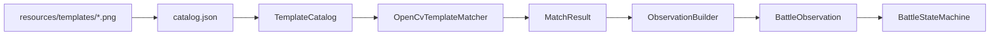
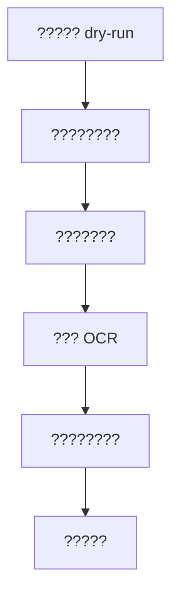

# ?????2?????????

## ????

???????

1. ?????
2. ???????
3. ??????????

---

## 1. ?????



---

## 2. ???????



---

## 2.5 ??????

??????????????????

???

- ???????? `window_focused`
- ???????????????????
- ?????????????????

?????

- `configs/env/local.json` ? `require_foreground=true`

???????

- ??????????????????????
- ????????? `run_once()` ????????

---

## 3. run_once ????



---

## 4. ???????



????

- ????? `resources`
- ??????? `perception`
- ???????? `BattleObservation`
- ????? `BattleObservation` ??

---

## 5. ?????

?????

- `D:\Codex\dhxy2-automation\scripts
un_battle_app.py`

?????????

- `D:\Codex\dhxy2-automation\srcpp\service.py`
- `BattleAutomationApp.run_once()`

?????

```powershell
$env:PYTHONPATH='D:\Codex\dhxy2-automation'
D:\Codex\dhxy2-automation\.venv\Scripts\python.exe D:\Codex\dhxy2-automation\scripts
un_battle_app.py
```

---

## 6. ????????????

????????

- `D:\Codex\dhxy2-automation\scripts
un_battle_app.py`
- `D:\Codex\dhxy2-automation\srcppootstrap.py`

????????????????

- `D:\Codex\dhxy2-automation\srcpp\observation_provider.py`
- `D:\Codex\dhxy2-automation\src\perception\services.py`
- `D:\Codex\dhxy2-automation\src\perception\observation.py`
- `D:\Codex\dhxy2-automation\src\state_machine\machine.py`

??????????????

- `D:\Codex\dhxy2-automation\src\policy\planner.py`
- `D:\Codex\dhxy2-automation\src\executor	ranslator.py`
- `D:\Codex\dhxy2-automation\src\executor\executor.py`

---

## 7. ??????????


